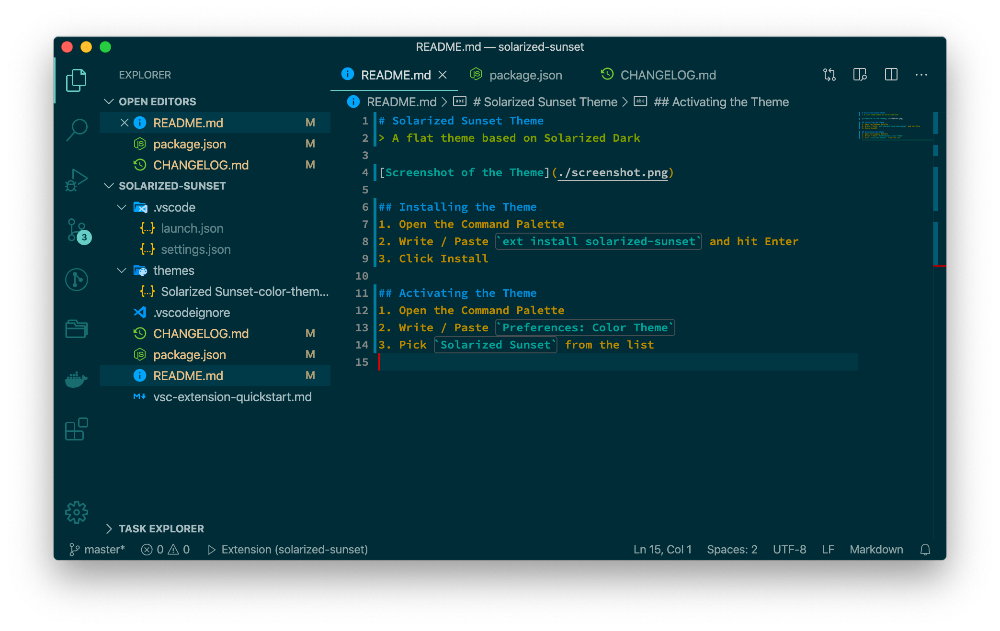

# Solarized Sunset Theme

Two flat themes based on the Solarized color scheme. The dark variant is called *Solarized Sunset* 🌇, the light variant *Solarized Sunrise* 🌅.

If you're looking for a matching font, I've created combined variants of Fira Code and Source Code Pro with *cursive italics*, named Victor Frankenstein. The font is freely available at <https://github.com/jansim/victor-frankenstein>.

Font: *Source Code Pro* with a weight of 600.

## Installing the Theme
1. Open the Command Palette
2. Write / Paste `ext install solarized-sunset` and hit Enter
3. Click Install

## Activating the Theme
1. Open the Command Palette
2. Write / Paste `Preferences: Color Theme` and hit Enter
3. Pick `Solarized Sunset` from the list for the dark variant or `Solarized Sunrise` for the light variant

## Attribution
Icon based upon original icon by [Bedon Style](https://www.iconfinder.com/R_studio) licensed under [CC BY 3.0](https://creativecommons.org/licenses/by/3.0/).

## Publishing the Extension
- Information on publishing to vscode registry [here](https://code.visualstudio.com/api/working-with-extensions/publishing-extension)
- Information on publishing to open-vsx [here](https://github.com/eclipse/openvsx/wiki/Publishing-Extensions)
